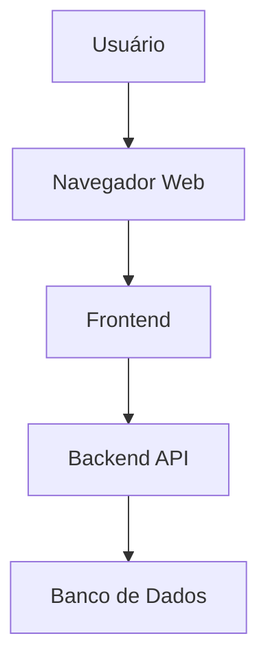
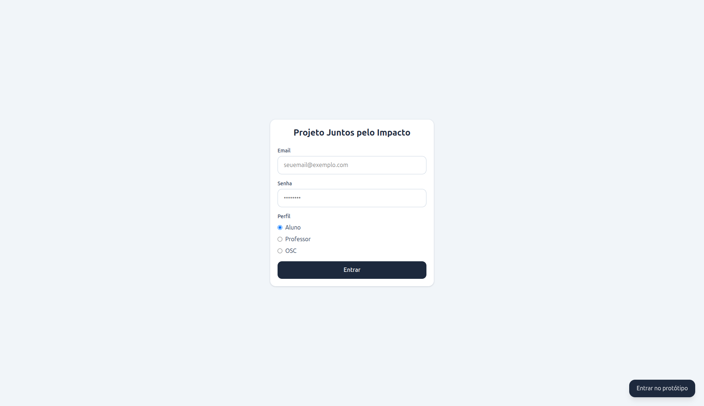
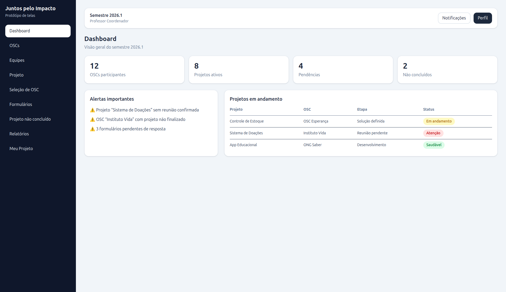
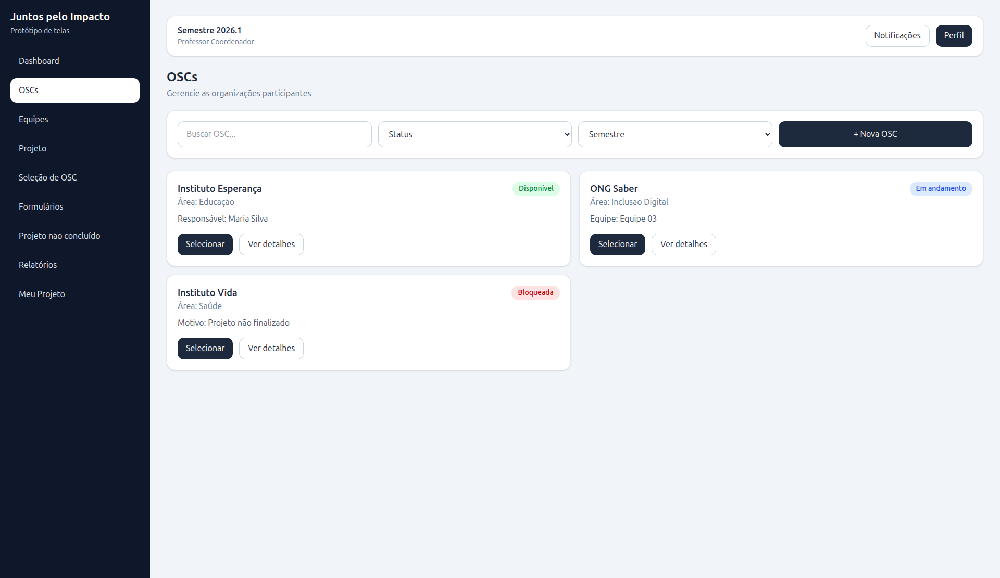
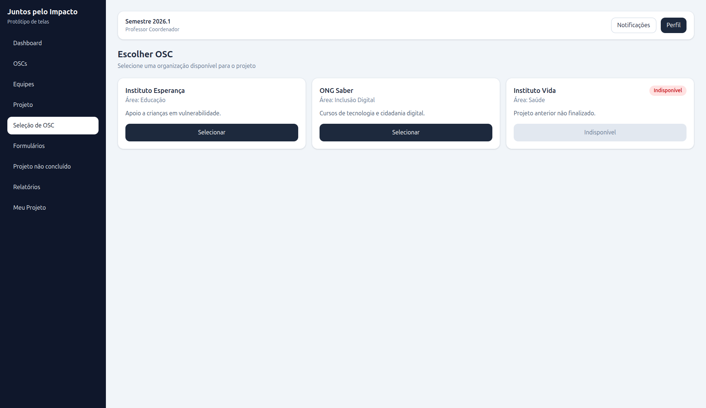

# Documento de Especificação Técnica - MVP Sistema de Gestão Juntos pelo Impacto (Revisado)

## 1. Introdução

Este documento detalha as especificações técnicas revisadas para o Produto Mínimo Viável (MVP) do Sistema de Gestão do Projeto Juntos pelo Impacto. Com um prazo de desenvolvimento e "implantação" de dois meses, o foco é em um MVP extremamente enxuto, priorizando as funcionalidades essenciais para validação inicial. O objetivo é fornecer uma visão clara das necessidades, requisitos, arquitetura proposta, mapeamento de telas e o escopo preciso para a primeira iteração do sistema, visando resolver os problemas mais críticos identificados na gestão atual do projeto.

## 2. Necessidades e Problemas Identificados

A gestão atual do programa "Juntos pelo Impacto" é predominantemente manual, utilizando planilhas e registros descentralizados. Isso gera uma série de dificuldades operacionais e impacta a eficiência e a rastreabilidade das informações. As principais necessidades e problemas a serem endereçados pelo MVP incluem:

*   **Fragmentação e Descontinuidade de Informações:** Dados dispersos e não consolidados, dificultando o acompanhamento da evolução das OSCs e projetos ao longo do tempo.
*   **Falta de Controle e Visibilidade:** Dificuldade em controlar a relação entre alunos, equipes e OSCs, bem como a ausência de visibilidade sobre o progresso dos projetos em andamento.
*   **Padronização Inexistente:** Falta de padronização na coleta de dados e na gestão da disponibilidade das OSCs, levando a problemas como duplicidade de seleção.
*   **Sobrecarga Operacional:** A gestão manual gera sobrecarga para as lideranças e riscos relacionados à segurança dos dados.

## 3. Requisitos do Sistema

### 3.1. Requisitos Funcionais (RF)

Os requisitos funcionais descrevem as funcionalidades essenciais que o MVP deve oferecer para atender às necessidades identificadas, focando no escopo mínimo acordado.

| ID | Funcionalidade | Descrição |
| :-- | :--- | :--- |
| RF001 | **Autenticação de Usuários** | O sistema deve permitir que usuários (Professor/Coordenador, Aluno) realizem login com credenciais válidas. |
| RF002 | **Gestão de Perfis de Acesso** | O sistema deve diferenciar as funcionalidades e informações acessíveis com base no perfil do usuário (Professor/Coordenador, Aluno). |
| RF003 | **Cadastro de OSCs** | O Professor/Coordenador deve ser capaz de cadastrar novas Organizações da Sociedade Civil (OSCs) no sistema. |
| RF004 | **Listagem e Visualização de OSCs** | O Professor/Coordenador deve poder visualizar uma lista de todas as OSCs cadastradas, com seus respectivos status. |
| RF005 | **Gestão de Status da OSC** | O sistema deve permitir que o Professor/Coordenador altere o status de uma OSC (ex: disponível, em andamento, bloqueada). |
| RF006 | **Seleção de OSC por Aluno/Equipe** | Alunos/Equipes devem poder visualizar e selecionar uma OSC disponível para seu projeto. |
| RF007 | **Remoção Automática de OSC Selecionada** | Após a seleção por uma equipe, a OSC deve ser automaticamente removida da lista de disponíveis para outras seleções. |
| RF008 | **Bloqueio de OSCs com Projetos Pendentes** | OSCs com projetos não finalizados no semestre anterior devem ser automaticamente bloqueadas para novas seleções. |
| RF009 | **Dashboard Gerencial (Professor/Coordenador)** | O Professor/Coordenador deve ter acesso a um painel com indicadores chave: quantidade de OSCs participantes, número de projetos ativos e alertas (simplificado). |

### 3.2. Requisitos Não Funcionais (RNF)

Os requisitos não funcionais definem as qualidades e restrições do sistema, adaptados para um MVP de desenvolvimento local.

| ID | Requisito Não Funcional | Descrição |
| :-- | :--- | :--- |
| RNF001 | **Usabilidade** | A interface do usuário deve ser intuitiva e de fácil aprendizado para todos os perfis de usuário, minimizando a necessidade de treinamento extensivo. |
| RNF002 | **Segurança** | O sistema deve implementar controle de acesso baseado em papéis (RBAC) e proteção básica contra vulnerabilidades comuns. |
| RNF003 | **Manutenibilidade** | O código-fonte deve ser bem documentado, modular e seguir padrões de codificação para facilitar futuras manutenções e evoluções. |
| RNF004 | **Compatibilidade** | O sistema deve ser compatível com os navegadores web modernos (Chrome, Firefox, Edge, Safari) e ser responsivo para diferentes tamanhos de tela (desktop, tablet, mobile). |
| RNF005 | **Ambiente de Desenvolvimento** | O sistema deve ser configurado para desenvolvimento local, sem a necessidade de infraestrutura de servidor ou balanceamento de carga para o MVP. |

## 4. Arquitetura do Sistema (Proposta para MVP Enxuto - Monorepo)

Para o MVP, propõe-se uma arquitetura de monorepo, com Frontend e Backend separados logicamente, mas gerenciados no mesmo repositório. Esta abordagem facilita o desenvolvimento local, a colaboração e o uso de ferramentas de IA (como Claude/GitHub Copilot) para acelerar o processo. A infraestrutura de servidor, load balancer e implantação não serão contempladas nesta fase inicial, focando exclusivamente no ambiente de desenvolvimento local.

**Componentes Chave:**

*   **Monorepo:** Estrutura de repositório único para gerenciar o código-fonte do Frontend e do Backend.
*   **Frontend:** Aplicação web responsiva desenvolvida com **Vite** e **React.js**.
*   **Backend:** API RESTful desenvolvida com **Node.js** utilizando o framework **NestJS**, responsável pela lógica de negócio e interação com o banco de dados.
*   **Banco de Dados:** **PostgreSQL** para persistência de dados relacionais, garantindo integridade e consistência no ambiente local.
*   **Autenticação:** Implementação de **JWT (JSON Web Tokens)** para autenticação segura e controle de acesso.

## 5. Mapeamento de Telas (MVP)

Com base no escopo ultra-enxuto, as telas essenciais para o MVP são:

| Tela | Descrição | Perfil de Acesso |
| :--- | :--- | :--- |
| **Login** | Autenticação de usuários. | Todos |
   
| **Dashboard (Professor/Coordenador)** | Visão geral com indicadores chave (OSCs, projetos, alertas). | Professor/Coordenador |

| **Gestão de OSCs (Professor/Coordenador)** | Cadastro, listagem e alteração de status de OSCs. | Professor/Coordenador |

| **Seleção de OSC (Aluno)** | Lista de OSCs disponíveis para seleção. | Aluno |

## 6. Escopo do MVP (Mínimo Produto Viável - Revisado)

O MVP focará nas funcionalidades que entregam o maior valor para resolver os problemas mais urgentes da gestão manual, priorizando a **eliminação do controle via planilhas** e a **centralização das informações** dentro do prazo de 2 meses.

**Funcionalidades INCLUÍDAS no MVP:**

*   **Autenticação e Gestão de Perfis:** Login para Professor/Coordenador e Aluno, com diferenciação de acesso.
*   **Cadastro e Gestão Básica de OSCs:** Cadastro, listagem e alteração de status (disponível, em andamento, bloqueada) por Professor/Coordenador.
*   **Fluxo de Seleção de OSC por Aluno/Equipe:** Visualização de OSCs disponíveis, seleção e remoção automática da lista.
*   **Regra de Bloqueio de OSCs:** Implementação da regra de bloqueio automático para OSCs com projetos não finalizados no semestre anterior.
*   **Dashboard Simplificado (Professor/Coordenador):** Um painel inicial com a quantidade de OSCs participantes e o número de projetos ativos.

**Funcionalidades EXCLUÍDAS do MVP (para futuras iterações):**

*   Registro de Projetos Não Concluídos.
*   Visualização do Status do Projeto (Aluno) detalhada.
*   Gestão de Formulários (para OSCs e Alunos).
*   Relatórios gerenciais avançados com filtros e exportação.
*   Notificações e alertas complexos.
*   Qualquer funcionalidade relacionada a implantação em servidor, load balancer, etc.

## 7. Conclusão do MVP

O MVP revisado visa entregar uma solução funcional e utilizável que digitaliza e centraliza os processos críticos de gestão do projeto Juntos pelo Impacto, focando nas interações essenciais entre Professor/Coordenador e Aluno para a gestão e seleção de OSCs. Ao limitar o escopo às funcionalidades mais críticas e à arquitetura de desenvolvimento local, será possível entregar uma primeira versão robusta dentro do prazo de dois meses, permitindo a validação rápida e a iteração futura com base no feedback dos usuários.
